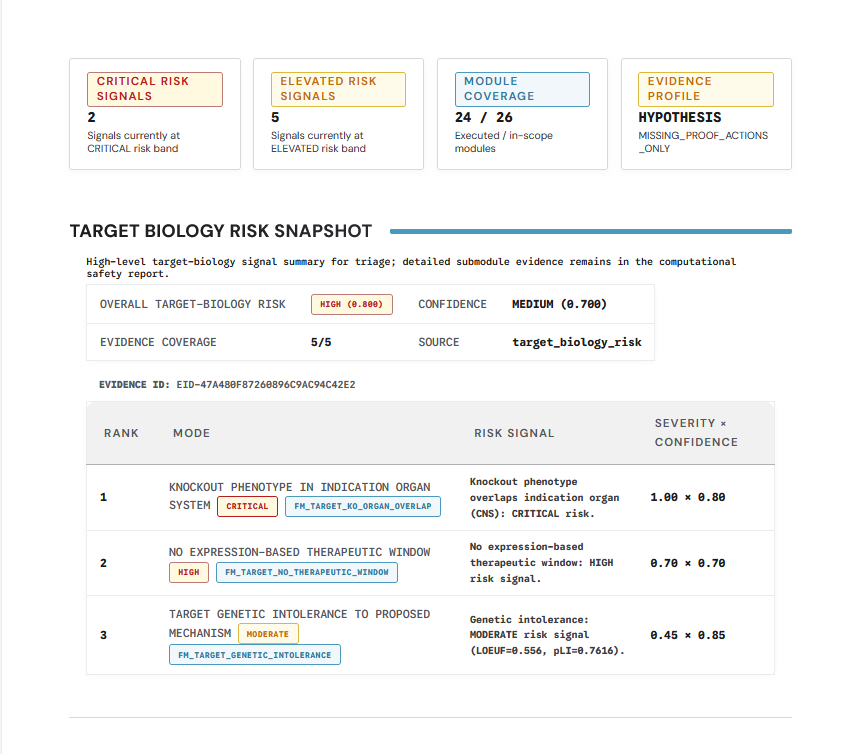
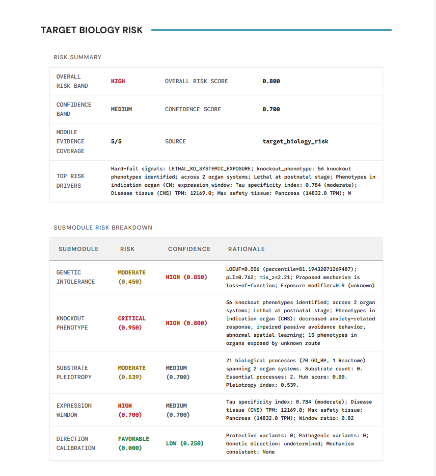
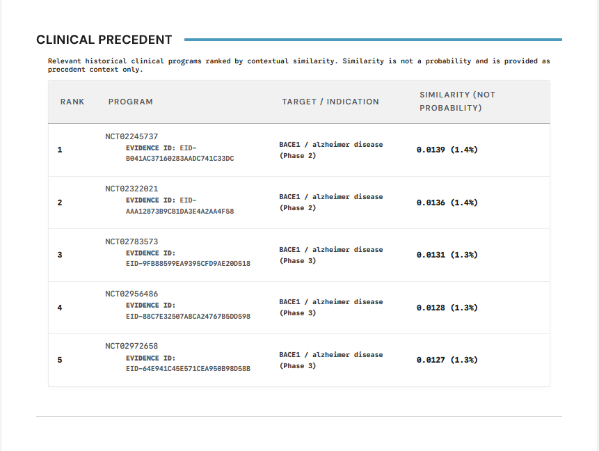
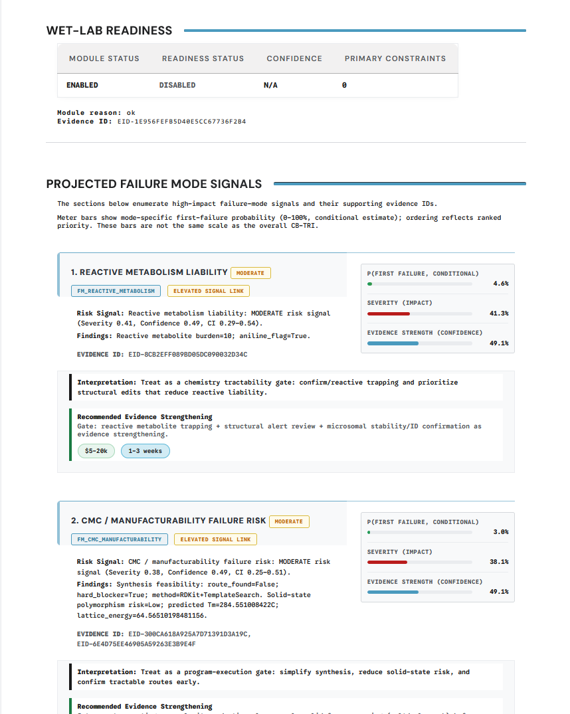
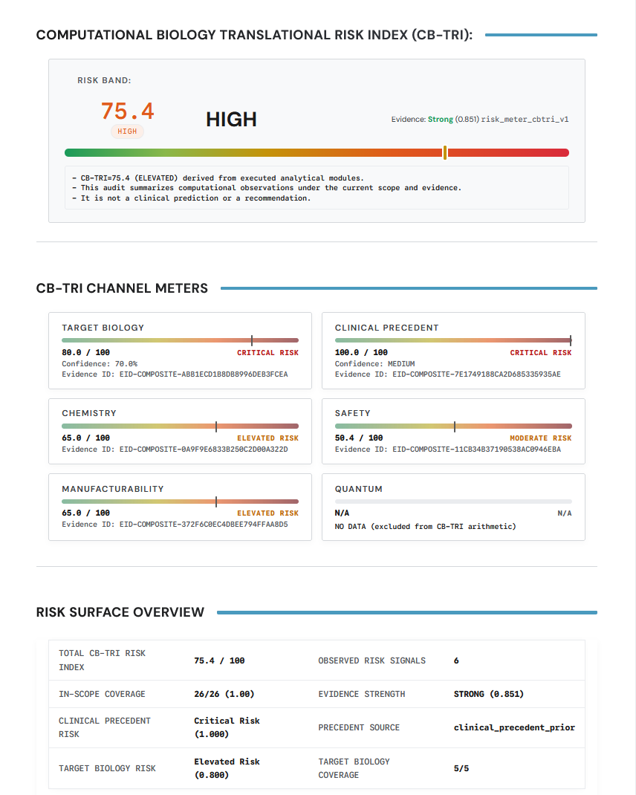

# Report Package Overview

Completed runs write their artifacts under a run-scoped output directory:

```text
<output-root>/<run_id>/
```

This page describes the major artifact families an operator or auditor should expect to find in that folder.

## Output structure at a glance

| Artifact | Typical location | Primary audience | Purpose |
| --- | --- | --- | --- |
| Run summary | `results/summary.json` | Operator, auditor, integrator | High-level run outcome and top-line results |
| Module plan | `plans/*_module_plan.json` | Operator, auditor | In-scope modules, tier compliance, and claim acceptance |
| Metrics | `results/metrics.json` | Operator, downstream automation | Structured machine-readable metrics |
| HTML reports | `results/*.html` | Operator, customer-facing decision workflow | Human-readable report package |
| Run manifest | `run_manifest.json` | Auditor, operator | Configuration, run identity, and runtime metadata |
| Input hash manifest | `inputs/input_hashes.json` | Auditor, operator | Per-input integrity mapping |
| Pre-seal metadata | `preseal.json` | Auditor | Inputs to the final sealing step |
| Seal bundle | `seal/seal.json`, `seal/seal.sig`, `seal/seal.svg` | Auditor, customer, verifier | Integrity and verification artifacts |

## Summary and metrics artifacts

Use the structured JSON files when you need stable machine-readable outputs for automation, indexing, or downstream integrations.

Common files in the example bundle include:

- `results/summary.json`
- `results/metrics.json`

Treat these as the fastest way to understand whether a run completed and what the top-level signals were.

## HTML report artifacts

The runner can emit multiple HTML reports depending on release and packaging. Common examples include:

- `results/phase5_combined_report.html`
- `results/phase5_comprehensive_report.html`
- `results/phase5_unified_report.html`
- `phase_5_computational_safety.html`
- `phase_5_conclusion_decision.html`

File names can vary by release, but the product role is stable: these artifacts are the main human-readable review surface.

## Example report panels

The `report_images/` directory in this docs repo contains representative report screenshots that help anchor the abstract artifact names to the actual review surface.

### Target biology risk summary



_Use summary-style panels like this for the first pass through a report section. They show the top-line verdict and the major evidence drivers without forcing the reader into detailed justification immediately._

### Target biology risk detail



_Detailed panels are the second-pass view. They matter when an operator or auditor needs to understand why a domain-specific section was scored the way it was and what evidence or missingness drove the result._

### Clinical precedent panel



_Clinical precedent is presented as a report-native section rather than a buried raw artifact. That is useful because precedent often shapes the interpretation of aggregate risk even when it is not the only driver._

### Projected failure modes panel



_Failure-mode views are where the report shifts from descriptive evidence to decision-relevant risk framing. Operators and auditors should expect these panels to explain why a package should proceed, pause, or escalate._

### CB-TRI panel



_CB-TRI-style panels are the top-line synthesis view. They are useful for fast triage, but they should always be read together with the underlying risk channels and coverage context._

## Verification-oriented artifacts

The verification set normally includes:

- `run_manifest.json`
- `inputs/input_hashes.json`
- `preseal.json`
- `seal/seal.json`
- `seal/seal.sig`
- `seal/seal.svg`
- `seal/VERIFY.md`

The current example bundle is still in a pre-verification state, so it includes `seal/preseal.json` and reports `seal_status=pending_online_verification`. Final seal artifacts appear only after the online completion and verification step succeeds.

## How to use the package

Recommended reading order:

1. Review `results/summary.json` or the top-level summary in the HTML report
2. Read the human-facing HTML report for context and interpretation
3. Inspect `run_manifest.json` when you need to confirm the exact run identity and configuration
4. Use the seal bundle when you need to validate provenance or support a rerun-verification workflow

For the audit-specific view, see [Reproducibility Pack](./reproducibility-pack.md) and [Verification Seal](./verification-seal.md).
